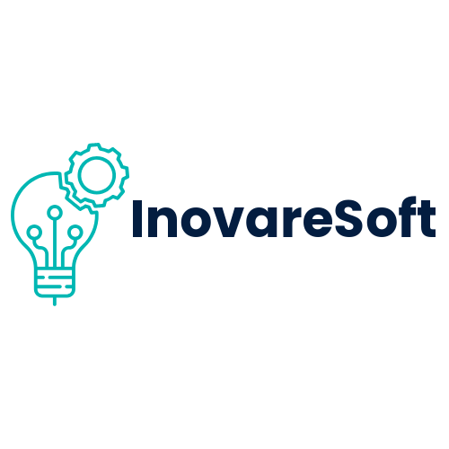

  

## 🚀 Welcome to InovareSoft

**InovareSoft** derives from the Latin *innovāre*—meaning **“to renew,” “to change,” or “to create innovation”** :contentReference[oaicite:1]{index=1}—combined with **Soft**, signaling our focus on software excellence.

---

### 🌟 Who We Are

At InovareSoft, we are a passionate team of developers and innovators committed to crafting modern, reliable, and impactful software solutions. Our mission is to *renew and transform* digital systems—by delivering:

- Scalable web applications & API systems  
- Bespoke desktop and mobile solutions  
- Clean, maintainable, and future-ready code

---

### 🛠 What We Build

1. **Web Platforms & Services**  
   Secure, user-centric websites, e-commerce systems, and leadership dashboards.

2. **Custom Software Solutions**  
   Enterprise-grade back-end systems for businesses and streamlined internal tools.

3. **Integrations & Automation**  
   Smart API-based integrations and workflows for optimized operations.

---

### 🧩 Our Philosophy

- **Innovare**: We embrace constant improvement—just like the meaning of our name.  
- **Soft**: We focus on stability, usability, and craftsmanship in software.  
- **Client-centric**: We build closely with stakeholders to solve real-world problems.  

---

### 🤝 Join Us

Looking to collaborate? Reach out at [omarmohamed20052003@gmail.com](mailto:omarmohamed20052003@gmail.com) or explore our public repositories to contribute and learn!

---

**InovareSoft** – *Software That Renews & Transforms*
